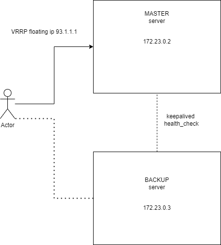

# High availability active/passive cluster build on top of Alpine linux with Keepalived and nginx

# Feautures of this project

Lightweight, secure Docker images build on top of Alpine Linux.

Automatically create logs for services, eg. nginx, keepalived, logrotate.

Manage logs by using scheduled plan for crond. It's purpose is to keep an eye for overgrowing log files.
Crond is being run by every 5 minutes to run logrotate to check if file log isn't too big.
Keepalived logs for current state also are being displayed.

Very customizable, good place to wrap around and sit in sandbox for testing purposes.

Added Keepalived for VRRP protocol used by containers to provide Failover High Availability cluster.

# Installation

**Before running whole setup, make sure to enable non local bind in your host system, e.g.**

In Debian/Ubuntu:

`$ sudo sysctl -w net.ipv4.ip_nonlocal_bind=1`

or

`$ echo 1 > /proc/sys/net/ipv4/ip_nonlocal_bind`

and then:

`$ sysctl -p`

to restart your services

## Clone repository or download it directly

`$ git clone https://github.com/Hoofinite/ha_docker_cluster.git`

## Change to current directory

`$ cd ha_docker_cluster`

## Build & run images

`$ docker-compose up --build -d`

# Usage

After everything is set up then go to host's web browser and type in VRRP interface ip adress:

`172.20.0.100`

or type in terminal

`$ curl -f 172.20.0.100`

If everything is set up correctly, you should see an master splashscreen.

# Testing 

If you want to test keepalived configuration, simply type *in master node* following commands:

`rc-service keepalived stop`

or

`killall keepalived`

OR

just pause *master node* container by typing:

` docker-compose pause *container*`
  
And then refresh your web browser, and you should see the output of backup node, also in log files, which become master in this case.
